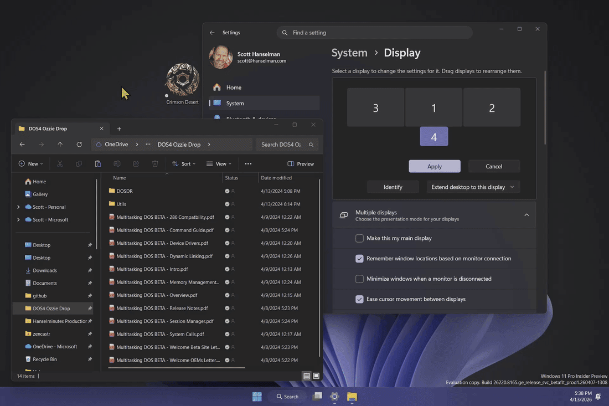

# PeekDesktop 👀

**Click empty desktop wallpaper to peek at it — just like macOS Sonoma.**

PeekDesktop brings macOS Sonoma's "click wallpaper to reveal desktop" feature to Windows 10 and 11. Click empty wallpaper and all windows minimize. Click or drag desktop icons normally without accidentally triggering peek. When you're done, click any window, the taskbar, or the wallpaper again and everything comes right back where it was.

<p align="center">
  
</p>

## Download

📥 **[Download the latest release](https://github.com/shanselman/PeekDesktop/releases/latest)**

| File | Platform |
|------|----------|
| `PeekDesktop-v0.1-win-x64.zip` | Intel/AMD (most PCs) |
| `PeekDesktop-v0.1-win-arm64.zip` | ARM64 (Surface Pro X, Snapdragon, etc.) |

No installer needed. Download the zip, extract it, and run `PeekDesktop.exe`. It lives in your system tray.

## How It Works

1. **Click empty desktop wallpaper** (not an icon) -> all windows minimize
2. **Stay on the desktop** -> click or drag icons, right-click, and rearrange things while windows stay hidden
3. **Click any app, the taskbar, or empty wallpaper again** -> all windows restore to exactly where they were

That's it. It just works.

### Under the Hood

PeekDesktop uses lightweight Windows APIs:

- **`SetWindowsHookEx(WH_MOUSE_LL)`** — low-level mouse hook to detect desktop clicks
- **`WindowFromPoint`** — identifies the window under your cursor
- **MSAA hit-testing (`AccessibleObjectFromPoint`)** — distinguishes empty wallpaper from desktop icons
- **`EnumWindows` + `WINDOWPLACEMENT`** — captures exact position and state (including maximized) of every window
- **`SetWinEventHook(EVENT_SYSTEM_FOREGROUND)`** — watches for when you switch back to an app
- **`SetWindowPlacement`** — restores windows to their exact previous positions

No admin rights required. Uses < 5 MB RAM idle.

## System Tray

Right-click the tray icon for options:

- ✅ **Enabled** — toggle the peek feature on/off
- 🔁 **Start with Windows** — launch automatically at login
- ℹ️ **About** — version info
- ❌ **Exit** — quit PeekDesktop

## macOS Sonoma vs PeekDesktop

| Feature | macOS Sonoma | PeekDesktop |
|---------|-------------|-------------|
| Click wallpaper to peek | ✅ | ✅ |
| Restore on app click | ✅ | ✅ |
| Restore on second wallpaper click | ✅ | ✅ |
| Clicking/dragging icons does not trigger peek | ✅ | ✅ |
| Desktop icons accessible | ✅ | ✅ |
| Exact window position restore | ✅ | ✅ |
| System tray control | ❌ | ✅ |
| Multi-monitor support | ✅ | ✅ |
| Start with OS | Login Items | ✅ Registry |
| Smooth animation | ✅ | Coming soon |

## Build from Source

**Requirements:** [.NET 8 SDK](https://dotnet.microsoft.com/download/dotnet/8.0)

```bash
git clone https://github.com/shanselman/PeekDesktop.git
cd PeekDesktop
dotnet build src/PeekDesktop/PeekDesktop.csproj
```

### Run it

```bash
dotnet run --project src/PeekDesktop/PeekDesktop.csproj
```

### Publish a self-contained single-file exe

```bash
# For Intel/AMD
dotnet publish src/PeekDesktop/PeekDesktop.csproj -c Release -r win-x64 --self-contained -p:PublishSingleFile=true

# For ARM64
dotnet publish src/PeekDesktop/PeekDesktop.csproj -c Release -r win-arm64 --self-contained -p:PublishSingleFile=true
```

## Architecture

```
src/PeekDesktop/
├── Program.cs          # Entry point, single-instance mutex
├── DesktopPeek.cs      # Core state machine (Idle ↔ Peeking)
├── MouseHook.cs        # WH_MOUSE_LL global mouse hook
├── FocusWatcher.cs     # EVENT_SYSTEM_FOREGROUND monitor
├── WindowTracker.cs    # Enumerate, minimize, and restore windows
├── DesktopDetector.cs  # Identify Progman/WorkerW desktop windows
├── TrayIcon.cs         # System tray NotifyIcon + context menu
├── Settings.cs         # JSON persistence + registry autostart
└── NativeMethods.cs    # Win32 P/Invoke declarations
```

### State Machine

```
┌──────┐  empty wallpaper click   ┌─────────┐
│ Idle │ ───────────────→ │ Peeking │
│      │ ←─────────────── │         │
└──────┘  app click / taskbar      └─────────┘
          click / wallpaper click
          to restore
```

## Contributing

PRs welcome! Current status and next ideas:

- [x] Click empty wallpaper to peek
- [x] Restore on app click or taskbar click
- [x] Restore on a second wallpaper click
- [x] Clicking or dragging desktop icons does **not** start peek
- [x] Desktop icons remain usable while peeking
- [x] Exact window positions are restored
- [ ] Smooth minimize/restore animations (slide/fade)
- [ ] Hotkey support (e.g., `Ctrl+F12` to toggle peek)
- [ ] Per-monitor peek (only minimize windows on the clicked monitor)
- [ ] Exclude specific apps from being minimized
- [ ] Better icon (the current one is programmatically generated)
- [ ] Windows 11 widgets area awareness
- [ ] Sound effect on peek/restore

## License

[MIT](LICENSE)
